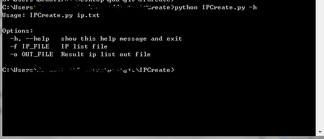
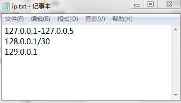

# IPCreate 0.1

这个脚本主要目标是解析IP网段（127.0.0.1/30或者127.0.0.1-127.0.0.10）列表内容，并生成所有可用的IP信息到指定文件。

## Author ##

咚咚呛 

如有其他建议，可联系微信280495355

## Support ##
技术细节如下

	1、支持格式：127.0.0.1-127.0.1.1
	2、支持格式：127.0.0.1/24
	3、默认加载当前目录的ip.txt文件，或者通过-f 来指定文件
	4、默认输出结果到当前目录的out.txt文件，或者通过-o 来指定文件

## Screenshot ##

